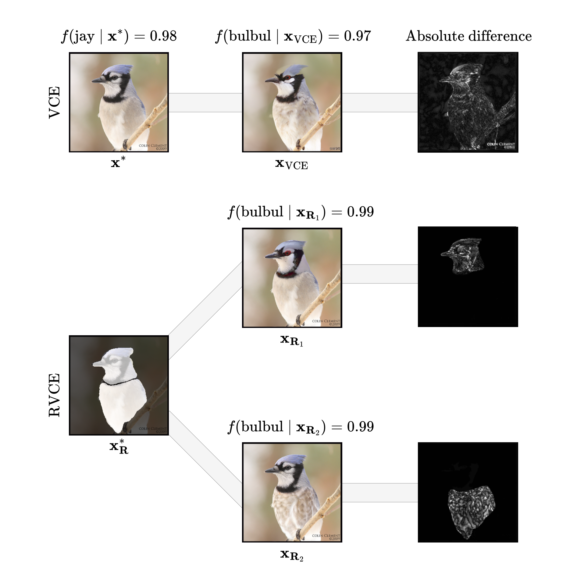

# [ICLR 2025] Rethinking Visual Counterfactual Explanations Through Region Constraint

This repository contains the official implementation for the paper [*Rethinking Visual Counterfactual Explanations Through Region Constraint*](https://openreview.net/forum?id=gqeXXrIMr0).

---

We propose _region-constrained_ visual counterfactual explanations (RVCEs) to better understand the decision-making process of deep learning predictive models. Contrary to standard VCEs, RVCEs constrain the image modification to an _a priori_ defined region, which may or may not depend on the model of interest. To sample them effectively, we extend [Image-to-Image Schrödinger Bridges](https://arxiv.org/abs/2302.05872) to conditional inpainting with the explained model through a series of algorithmic adaptations, resulting in the _Region-constrained Counterfactual Schrödinger Bridge_ (RCSB).



## Conda environment

We suggest installing a Conda environment with the following commands:

```bash
conda env create -f environment.yaml
conda activate rcsb
```

If you prefer to avoid Conda and use only pip, run:

```bash
python -m venv rcsb
source rcsb/bin/activate
pip install -r requirements.txt
```

## Data and checkpoints

We provide all necessary data as a zipped directory available under [this link](https://drive.google.com/file/d/1lW21PiaelB98L9OeAsKppLgftnOw3ZaH/view?usp=sharing). After downloading, unzip it in the root of this repository. It includes:

- I2SB checkpoints for ImageNet, CelebA, and CelebA-HQ
- Classifier checkpoints for the respective datasets
- CelebA and CelebA-HQ datasets in a format compatible with this codebase
- Metadata to speed up code execution

Note that all credits are due to the respective dataset authors (listed below). We do not include ImageNet, as it is subject to a different license.

- CelebA: [Large-scale CelebFaces Attributes (CelebA) Dataset](https://mmlab.ie.cuhk.edu.hk/projects/CelebA.html)  
- CelebA-HQ: [Progressive Growing of GANs for Improved Quality, Stability, and Variation](https://arxiv.org/abs/1710.10196)  
- CelebA DenseNet: [Beyond Trivial Counterfactual Explanations with Diverse Valuable Explanations](https://arxiv.org/abs/2103.10226)  
- CelebA-HQ DenseNet: [STEEX: Steering Counterfactual Explanations with Semantics](https://arxiv.org/abs/2111.09094)

## Running the code

Our codebase is built around the [Hydra](https://hydra.cc/docs/intro/) and [Lightning Fabric](https://lightning.ai/docs/fabric/stable/) packages. The latter allows for easy adaptation to distributed inference, while the former provides a flexible way to configure experiments.

### RCSB

To run the default ImageNet version of RCSB (automated region extraction), use:

```bash
WANDB_MODE=<offline/online> HYDRA_FULL_ERROR=<0/1> python src/main.py \
--config-name imagenet_cava_target_to_guide \
exp.target_id=$TARGET_ID \
exp.guide_id=$GUIDE_ID \
guidance.scale.value=$GUIDANCE_SCALE \
inpainter.subconfig.start_step=$START_STEP \
explainer.cell_size=$CELL_SIZE \
explainer.area=$AREA
```

- `TARGET_ID` is the class initially predicted by the classifier. It first filters the samples to those predicted as this class by the classifier.  
- `GUIDE_ID` is the target class to be achieved after inpainting.

Following the paper’s notation:  
- `GUIDANCE_SCALE = s`  
- `START_STEP = τ * T`  
- `CELL_SIZE = c`  
- `AREA = a`

We recommend the following settings for balanced performance:

```bash
GUIDANCE_SCALE=1.5
START_STEP=600
CELL_SIZE=16
AREA=0.3
```

### LangSAM regions

Using LangSAM for region extraction requires installing GroundingDino from source. After creating the Conda environment, run:

```bash
git clone https://github.com/IDEA-Research/GroundingDINO.git
cd GroundingDINO/
pip install -e .
```

To use the LangSAM explainer, run:

```bash
WANDB_MODE=<offline/online> HYDRA_FULL_ERROR=<0/1> python src/main.py \
--config-name imagenet_cava_target_to_guide \
exp.target_id=$TARGET_ID \
exp.guide_id=$GUIDE_ID \
explainer=lang_sam \
explainer.get_attr_maps_kwargs.text_prompt=$TEXT_PROMPT \
explainer.get_attr_maps_kwargs.use_binary_masks=$USE_BINARY_MASKS
```

A single A100 GPU supports only `exp.n_inpaints=1` when using LangSAM. Setting `USE_BINARY_MASKS=true` uses the original binary masks provided by LangSAM and disables `explainer.area` control. To regain area control, set `USE_BINARY_MASKS=false`. This selects pixels from the mask with the highest logits from LangSAM if the original area is larger than `explainer.area`. To specify a custom text prompt, assign it to `TEXT_PROMPT`.

### Manual regions

For manually selected regions, we provide a script at `custom_masks/generate.py` for region painting and saving. Example ImageNet samples with user-defined regions are available in `custom_masks/imagenet` and can be used via the following command:

```bash
WANDB_MODE=<offline/online> HYDRA_FULL_ERROR=<0/1> python src/main.py \
--config-name imagenet_cava_target_to_guide \
exp.target_id=$TARGET_ID \
exp.guide_id=$GUIDE_ID \
guidance.scale.value=$GUIDANCE_SCALE \
inpainter.subconfig.start_step=$START_STEP \
dataset=custom_mask_imagenet
```

where the following initial and target classes must be used:

```bash
TARGET_ID=340
GUIDE_ID=339
```

## References

If you find our work useful, please cite it as:

```bibtex
@inproceedings{sobieski2024rethinking,
  title={Rethinking Visual Counterfactual Explanations Through Region Constraint},
  author={Sobieski, Bartlomiej and Grzywaczewski, Jakub and Sadlej, Bart{\l}omiej and Tivnan, Matthew and Biecek, Przemyslaw},
  booktitle={The Thirteenth International Conference on Learning Representations},
  year={2025},
  url={https://openreview.net/forum?id=gqeXXrIMr0}
}
```
